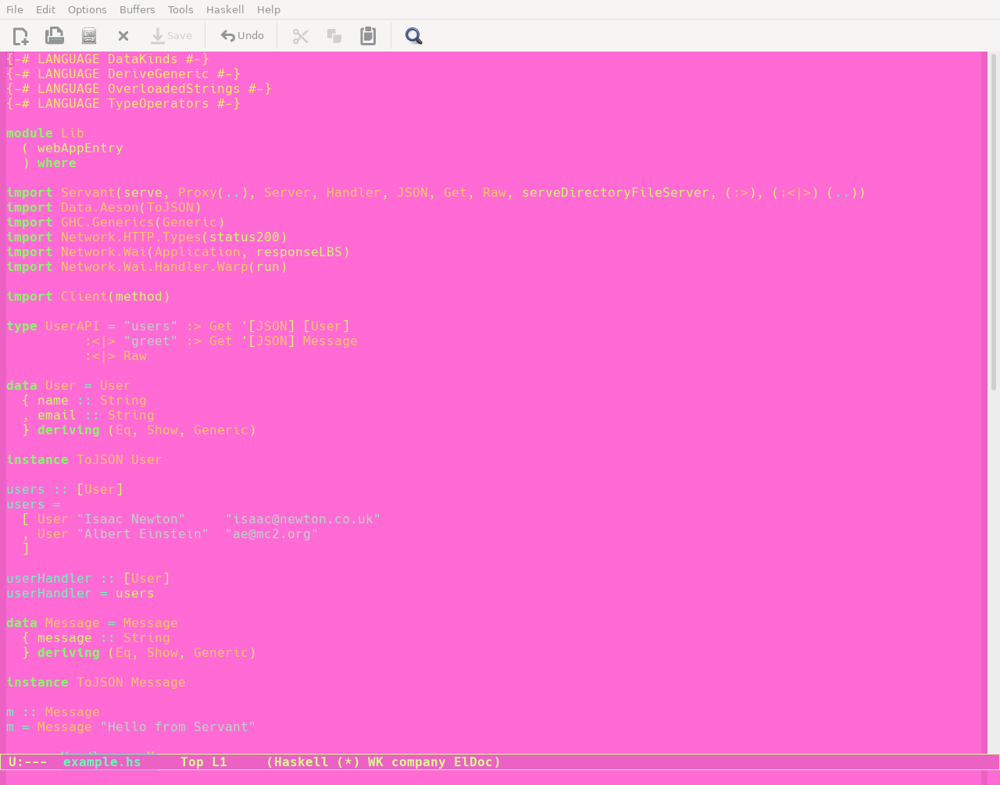

# Vaporwave

Hi! This is a vaporwave them I created using [ThemeCreator](https://mswift42.github.io/themecreator/#) and a [color calculator](https://www.sessions.edu/color-calculator/) :slightly_smiling_face:

## Screenshot

Here's what it looks like in emacs viewing a Haskell file

